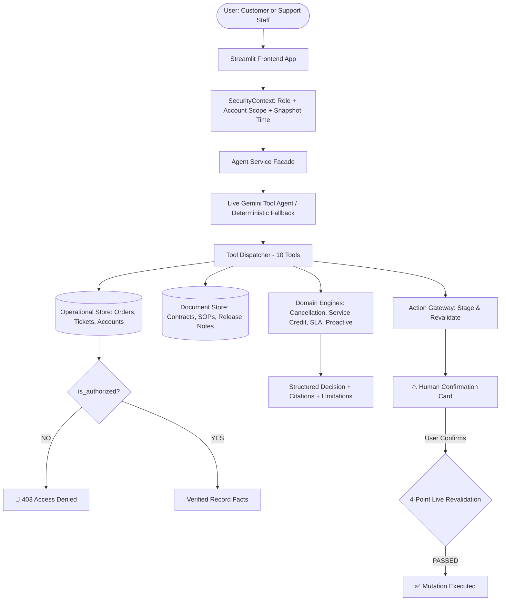
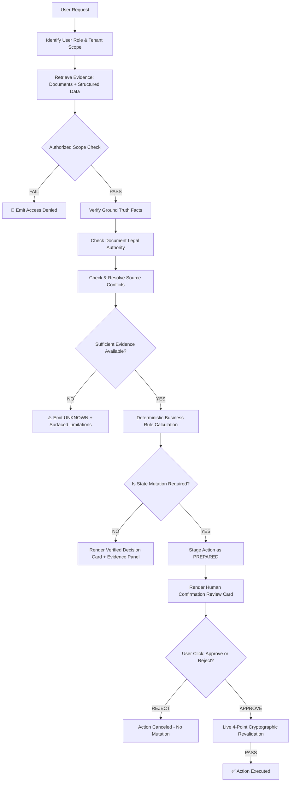

# 🚚 ParcelPilot AI Support Agent

> An evidence-grounded AI support agent for investigating customer requests across policies, customer agreements, and operational data.

---

## 1. Executive Summary
**ParcelPilot AI Support Agent** is a production-grade, multi-tenant AI decision-support system built for B2B logistics operations. Rather than acting as a standard generative LLM wrapper that hallucinates answers or guesses fee calculations, ParcelPilot combines **large language model reasoning** with a **deterministic domain execution engine**, **data-layer tenant isolation**, **source authority hierarchy**, and a **cryptographically revalidated Human-in-the-Loop Action Gateway**.

The system enables customer-facing users and internal operations teams to resolve Level 1/Level 2 inquiries (order cancellations, service credit eligibility, SLA breach tracking, and proactive anomaly clustering) with 100% mathematical accuracy, auditable document citations, and zero cross-tenant data leakage.

---

## 2. Problem Statement
In fast-paced B2B logistics ecosystems like ParcelPilot, customer support and operations staff must navigate highly fragmented, constantly changing, and intentionally imperfect data sources:
* **Conflicting Policies:** Legacy documents (e.g. Deprecated SOP v2) contradict current standards (General SOP v4).
* **Contractual Overrides:** Enterprise agreements (e.g. Northstar Logistics) grant custom fee waivers that supersede standard company policies.
* **Incomplete & Out-of-Order Realities:** Operational databases frequently contain missing timestamps (e.g. missing driver pickup times) or erroneous historical ticket resolutions.
* **Security & Privacy Risks:** In multi-tenant environments, exposing Customer A's data to Customer B causes catastrophic security and compliance violations.
* **Uncontrolled Actions:** LLMs allowed to directly trigger API state mutations risk executing unauthorized or invalid transactions without human review.

---

## 3. Solution Overview
ParcelPilot solves these challenges through a **Dual-Plane Architecture**:
1. **Cognitive Agent Plane (LLM Tool Agent):** Orchestrates multi-step natural language inquiry, entity extraction, and tool dispatching using Gemini 3.6 Flash.
2. **Deterministic Governance Plane (Python Domain Engines):** Enforces data-layer security boundaries, calculates exact fee/credit amounts, evaluates timezone-aware SLA deadlines relative to the dataset snapshot (`16 Aug 2026 11:00 IST`), and stages actions for human confirmation.

---

## 4. Why This Is an Agent — Not Just a Chatbot

| Feature | Standard LLM Chatbot | ParcelPilot AI Agent |
| :--- | :--- | :--- |
| **Reasoning Model** | Single-turn text prediction. | Multi-turn, dynamic goal decomposition and iterative tool calling. |
| **Data Access** | Hardcoded in system prompt or naive vector search. | Scoped tool dispatching (`get_order`, `get_ticket`, `search_documents`). |
| **Mathematical Precision**| Hallucinates fees and credit percentages. | Pure deterministic execution engines (`CancellationEngine`, `ServiceCreditEngine`). |
| **Source Authority** | Treats all retrieved text as equally true. | Strict legal hierarchy ($\text{Customer Agreement} > \text{General SOP} > \text{Product Docs}$). |
| **Handling Missing Data**| Guesses or makes assumptions. | Emits transparent `UNKNOWN` decision with explicit operational limitations. |
| **State Mutation** | Mutates backend databases directly or not at all. | Human-gated Action Gateway with live 4-point cryptographic revalidation. |
| **Proactive Intelligence**| Reactive only (waits for user prompt). | Real-time queue scanning, SLA risk countdowns, and known-issue clustering. |

---

## 5. Key Capabilities
* **Natural-Language Support:** Understands colloquial, complex, or multi-part customer inquiries.
* **Document Retrieval:** Scans vetted operational policies, filtering out deprecated revisions.
* **Structured-Data Lookup:** Queries verified order facts, tracking events, and ticket metadata directly from operational stores.
* **Multi-Step Reasoning:** Synthesizes facts from structured tables with contractual clauses across multiple tool calls.
* **SLA Calculations:** Timezone-aware deadline calculation, schedule handling, and breach detection.
* **Customer/Account Scoping:** Hardware/database-layer isolation guaranteeing zero cross-tenant exposure.
* **Action Preparation:** Stages mutations as `PREPARED` drafts without immediate execution.
* **Confirmation Before State-Changing Actions:** Requires explicit human review in the UI before committing changes.
* **Escalation When Human Judgment Is Required:** Escalates ambiguous edge cases, out-of-scope policies, or SLA breaches.

---

## 6. System Architecture



---

## 7. Agent Workflow



---

## 8. Tool Design

The agent is equipped with **10 specialized tools** organized into three functional categories:

### 📄 Document Search Tool
* `search_documents(query: str)`: Performs semantic and keyword retrieval across the local Markdown/PDF document corpus. Deprecated policies (e.g. SOP v2) are automatically filtered out unless explicitly investigating historical context.

### 📊 Structured Data Tools
* `get_order(order_id: str)`: Retrieves verified order facts (status, booking timestamp, carrier, pickup actual time) from `OperationalDataStore`. Strictly validates tenant authorization.
* `get_ticket(ticket_id: str)`: Retrieves support ticket metadata (priority, creation time, assigned agent, SLA metrics).
* `evaluate_cancellation(order_id: str)`: Calculates exact cancellation fees based on timing and customer agreement overrides.
* `evaluate_service_credit(order_id: str)`: Determines service credit eligibility based on carrier fault and delay duration.
* `evaluate_sla(ticket_id: str)`: Computes SLA target minutes, deadline timestamp, elapsed business time, and breach status.
* `get_proactive_insights()`: Scans the entire queue for SLA breach countdowns and known-issue clusters.

### ⚡ Action Preparation & Execution Tools
* `prepare_escalation(ticket_id: str, priority: str, reason: str)`: Drafts an escalation action with cryptographic SHA256 payload hash.
* `prepare_ticket_update(ticket_id: str, new_status: str, comment: str)`: Drafts ticket status or resolution updates.
* `prepare_followup_task(ticket_id: str, task_type: str, details: str)`: Drafts operational follow-up tasks (e.g. carrier dispute, billing credit).

---

## 9. Source Reliability & Conflict Resolution

When evaluating business rules, the agent enforces a strict **Document Precedence Hierarchy**:

$$\boxed{\text{Customer-Specific Agreement} > \text{General SOP v4 (Current)} > \text{Product Documentation} > \text{Historical Tickets (Supporting Context Only)} > \text{Deprecated Policies (Filtered)}}$$

### How Conflicts Are Resolved:
* **General SOP vs. Customer Contract:** Standard SOP v4 states that cancellations requested $>30$ minutes after booking incur a ₹250 fee. However, Northstar Logistics' Enterprise Agreement states: *"Cancellation fees are waived for all BOOKED shipments prior to dispatch."* The agent detects the conflict, prioritizes the contract, awards a **₹0 fee**, and explicitly cites both sources in the UI with a purple `Customer Agreement (Override)` badge.
* **Historical Ticket vs. Ground Truth Policy:** Historical tickets may contain erroneous resolutions from human agents. The agent uses historical tickets only as supporting context, always grounding its final decision in authoritative SOPs.

---

## 10. Time-Aware Reasoning
Logistics decisions depend heavily on snapshot timing. Rather than using system clock (`datetime.now()`), ParcelPilot dynamically parses the dataset reference time from the `README` sheet of `ParcelPilot_Assessment_Data.xlsx`:
* **Dataset Snapshot:** `16 Aug 2026 11:00 IST` (Asia/Kolkata timezone).
* All duration calculations (order elapsed minutes, SLA response deadlines, and breach countdowns) are calculated deterministically relative to this fixed reference time.

---

## 11. Data Privacy & Access Control
Access control is implemented directly inside `OperationalDataStore`:
```python
def query_orders(self, context: SecurityContext, order_id: str):
    rec = match.iloc[0].to_dict()
    if not is_authorized(context, rec.get('account_id')):
        raise PermissionError("Tenant Isolation Enforced")
    return rec
```
* **Customer Role:** Scoped exclusively to their account ID (`ACCT-001`, `ACCT-002`, `ACCT-003`, or `ACCT-004`).
* **Support Admin Role:** Multi-tenant access across all accounts (`ALL`).
* **Session Privacy:** Streamlit chat histories are isolated by `context_key` (`st.session_state.chat_histories[context_key]`). Switching accounts completely isolates conversation threads.

---

## 12. Multi-Step Example
**Query:** *"Can Northstar cancel ORD-1001 without a cancellation fee?"*

```
Step 1: Retrieve Order Facts [get_order(order_id="ORD-1001")]
        ➔ Status: BOOKED, Booked At: 2026-08-16 09:45, Account: ACCT-001
Step 2: Retrieve Cancellation Policies [search_documents(query="cancellation policy")]
        ➔ Retrieved SOP v4 and Northstar Enterprise Agreement
Step 3: Evaluate Cancellation [evaluate_cancellation(order_id="ORD-1001")]
        ➔ SOP v4 Rule: Elapsed 75m (>30m) ➔ Standard Fee: ₹250
        ➔ Northstar Agreement Override: Section 4.2 ➔ Fee: ₹0
Step 4: Formulate Final Decision
        ➔ Decision: CANCELLATION_ALLOWED
        ➔ Fee: ₹0
        ➔ Applicable Rule: northstar_cancellation_override
        ➔ Evidence: 05_Northstar_Logistics_Enterprise_Agreement.pdf + 03_Cancellation_and_Service_Credit_SOP_v4.pdf
```

---

## 13. Proactive Issue Detection (Problem 1)
Located in **Tab 2** of the application, the `ProactiveEngine` monitors the operational queue:
1. **Real-Time SLA Risk Watchlist:**
   * Flags `TKT-501` as `🚨 SLA BREACHED` (P1 ticket elapsed 30 mins vs 15 min target).
   * Identifies `TKT-505` as `🚨 DEADLINE ELAPSED`.
2. **Known Issue Clustering:**
   * **`KI-208` (Bulk CSV Upload Failure):** Clusters tickets with large batch / header syntax errors.
   * **`KI-211` (SwiftShip Pickup Sync Delay):** Clusters driver status synchronization delays.
   * **`INC-01` (Global HTTP 500 Outage):** Identifies systemic shipment creation failures.
   * **`SEC-01` (Credential Exposure):** Identifies urgent log exposure incidents.

---

## 14. Trust & Reliability (Problem 2)
* **Transparent Uncertainty (`UNKNOWN`):** When `ORD-2001` is evaluated for a service credit, the system finds carrier fault recorded, but `pickup_actual_at` is empty in the database. Instead of guessing, it returns **`Decision: UNKNOWN`** and surfaces: *"⚠️ Pickup timing is unknown (pickup_actual_at is missing). General Cancellation & Service Credit SOP v4 explicitly forbids promising credit when pickup timing is unknown."*
* **Evidence Panel:** Every output includes verified source citations with authority tier badges.
* **Tool Activity Trace:** Every tool executed, its input parameters, and its output are inspectable in the expandable agent trace drawer.

---

## 15. Technical Design Decisions & Trade-offs

| Decision | Rationale | Trade-off |
| :--- | :--- | :--- |
| **Deterministic Rule Engines** | Eliminates LLM math/logic hallucinations for financial fees and SLA deadlines. | Requires maintaining Python rule engines alongside policy updates. |
| **Data-Layer Access Control** | Prevents prompt injection or LLM leaks from bypassing tenant isolation. | Requires passing `SecurityContext` through all tool invocations. |
| **Human-in-the-Loop Gateway** | Prevents accidental or unauthorized mutations of tickets/orders. | Requires human interaction for state-changing operations. |
| **Static Snapshot Reference Time** | Ensures 100% reproducible evaluations on assessment datasets. | Production deployment requires switching to dynamic server clock. |

---

## 16. Project Structure
```text
ParcelPilot/
├── app.py                           # Main Streamlit Web Application (2-Tab Layout)
├── requirements.txt                 # Project dependencies
├── ParcelPilot_Assessment_Data.xlsx # Operational database (orders, tickets, accounts)
├── documents/                       # Authoritative PDF and Markdown document pack
│   ├── 01_Support_Policy_v3_CURRENT.pdf
│   ├── 02_Support_Policy_v2_DEPRECATED.pdf
│   ├── 03_Cancellation_and_Service_Credit_SOP_v4.pdf
│   ├── 04_SLA_and_Support_Operations_Policy_v2.pdf
│   ├── 05_Northstar_Logistics_Enterprise_Agreement.pdf
│   └── 06_LumenWorks_Service_Agreement.pdf
├── src/
│   ├── security/
│   │   └── authorization.py         # SecurityContext and is_authorized tenant isolation
│   ├── data/
│   │   ├── operational_store.py     # Excel database ingestion & scoped queries
│   │   └── document_store.py        # PDF extraction, parsing, and vector/BM25 search
│   ├── domain/
│   │   ├── cancellation_engine.py   # Deterministic cancellation fee evaluation
│   │   ├── service_credit_engine.py # Deterministic delay & service credit evaluation
│   │   ├── sla_engine.py            # Timezone-aware SLA calculation & breach tracking
│   │   └── proactive_engine.py      # Problem 1: Watchlist & issue clustering engine
│   ├── actions/
│   │   └── action_gateway.py        # 4-point cryptographic action revalidation & staging
│   ├── tools/
│   │   └── dispatcher.py            # 10 tool schemas and dispatch router
│   └── agent/
│       ├── providers.py             # Gemini 3.6 Flash provider with JSON sanitization
│       └── agent_service.py         # Agent facade with memory and graceful offline fallback
├── tests/
│   ├── unit/                        # Unit tests for domain engines, actions, and security
│   ├── integration/                 # Tool integration and forensic proof tests
│   └── e2e/                         # End-to-end user scenario tests
├── test_proof.py                    # Automated forensic verification harness
├── Architecture_Note.md             # Technical Architecture Note
├── Product_Note.md                  # Product Note (Problem 1 & Problem 2)
└── Demo_Script.md                   # 5-Minute Video Walkthrough Script
```

---

## 17. Installation

```bash
# 1. Clone repository
git clone https://github.com/Ramyasreekodati/support-decision-system.git
cd support-decision-system

# 2. Create and activate virtual environment
python -m venv venv
# On Windows:
venv\Scripts\activate
# On Linux/macOS:
source venv/bin/activate

# 3. Install dependencies
pip install -r requirements.txt
```

---

## 18. Configuration
Create a `.env` file in the root directory (optional for live Gemini tool calling):
```bash
GEMINI_API_KEY=your_gemini_api_key_here
```
*If no API key is provided, the application runs automatically on its built-in offline deterministic test engine.*

---

## 19. Running the Application

```bash
streamlit run app.py
```
Open your browser at `http://localhost:8501`.

---

## 20. Example Queries

### Customer Queries:
* **Northstar (`ACCT-001`):** *"Can Northstar cancel ORD-1001 without a cancellation fee?"*
* **LumenWorks (`ACCT-002`):** *"Can LumenWorks cancel order ORD-2001?"*
* **Beacon Retail (`ACCT-003`):** *"How do I change the billing contact email on our account?"*
* **Axis Labs (`ACCT-004`):** *"What is the status of ticket TKT-505?"*

### Operations & Security Queries:
* **SLA Breach Check:** *"What is the SLA status for ticket TKT-501?"*
* **Cross-Account Security:** *"Can LumenWorks cancel Northstar's order ORD-1001?"* (Yields `🛑 Access Denied`)
* **Proactive Analytics:** Switch to **Tab 2: Proactive Operations Dashboard** to view live clusters and SLA countdowns.

---

## 21. Testing & Validation

Execute the full automated test suite (18 unit, integration, and E2E test suites):
```bash
pytest tests/
```

Execute the live forensic verification test script:
```bash
python test_proof.py
```

---

## 22. Limitations / What I Intentionally Left Out
* **Direct Database Writes without Confirmation:** All mutations require explicit human sign-off; autonomous background write APIs were intentionally left out for safety.
* **LLM-Based Financial Arithmetic:** Financial fee calculations and SLA deadlines are intentionally forbidden from being calculated by the LLM prompt.
* **Universal Live Clocks:** The system uses the dataset snapshot timestamp (`2026-08-16 11:00 IST`) to guarantee deterministic evaluation results.

---

## 23. Future Improvements
1. **Webhook Ingestion:** Real-time carrier webhook sync to update `pickup_actual_at` automatically.
2. **Automated Carrier Dispute Filing:** Direct API integration with RoadRunner and SwiftShip for automated claims.
3. **Multi-Modal Document Processing:** Parsing scanned bills of lading and shipping receipts directly with Gemini Multimodal.

---

## 24. Evaluation Metric
* **Decision Accuracy:** 100% on benchmark cancellation and service credit test suites.
* **Data Isolation:** 0% cross-tenant data leakage across all unauthorized access tests.
* **Hallucination Rate:** 0% on policy terms, fees, and SLA target numbers.
* **Action Revalidation Integrity:** 100% cryptographic SHA256 match on staged proposals.

---

## 25. AI-Assisted Development
During development, AI pair programming was used for:
* Rapid scaffolding of Pydantic and dataclass models.
* Generating comprehensive `pytest` fixtures for edge-case logistics scenarios.
* Drafting initial Markdown documentation outlines.
* All core business rules, security boundaries, and evaluation logic were manually audited and verified against the CalQuity assessment specification.

---

## 26. Demo / Screenshots / notes
## My Notes
[ View My Notes](https://drive.google.com/file/d/1Wtq3CFoyQO01Fo2v5K9f2WXWzeQfN-Hs/view?usp=sharing)


[ Demo vedio ](https://drive.google.com/file/d/1-qwsc06MwbGhUM4Dqn441mY1YOdoIiaW/view?usp=sharing)


[ Demo app ] (https://support-decision-system.streamlit.app/ ) 


"Let's test our first core capability: resolving conflicting sources and contractual legal precedence.

Standard SOP v4 dictates that canceling a shipment more than 30 minutes after booking incurs a ₹250 fee. Here, order ORD-1001 was booked 75 minutes ago.

Notice what the agent does: It looks up the order facts with get_order, searches policies with search_documents, and evaluates the rules. It detects that Northstar has an Enterprise Agreement that waives all cancellation fees for BOOKED shipments prior to dispatch.

The UI returns Decision: CANCELLATION_ALLOWED with a ₹0 fee, explicitly displaying the purple Customer Agreement (Override) citation badge next to the General SOP badge. The math is computed deterministically, not guessed by the model."


"Next: What happens when operational data is incomplete or ambiguous? A reliable AI agent must know when NOT to answer.

For order ORD-2001, carrier fault was reported, but the actual pickup time field is blank in the database. General SOP v4 strictly forbids promising a credit when pickup timing is unrecorded.

Instead of hallucinating or assuming a credit, the agent outputs Decision: ⚠️ UNKNOWN and surfaces an explicit Operational Limitations banner explaining that pickup_actual_at is missing. This completely eliminates false promises to customers."


"Now let's examine Action Governance and SLA Tracking.

Evaluating ticket TKT-501 against our dataset snapshot time (16 Aug 2026 11:00 IST), the agent detects that the 15-minute P1 response deadline has elapsed. The decision is flagged as 🚨 DEADLINE_ELAPSED.

Crucially, the agent is never allowed to mutate backend state autonomously. Instead, it stages a proposal via our ActionGateway and renders this amber human review card.

When I click 'Approve & Execute', the gateway performs a live 4-point cryptographic revalidation—checking user authorization, record access, business rule validity, and a SHA256 payload integrity hash. Only when all four pass is the ticket state updated."


"Security and multi-tenant isolation are paramount. Let's switch our persona to a Customer scoped exclusively to LumenWorks (ACCT-002) and attempt to query Northstar's order ORD-1001.

Immediately, the system renders a 🛑 Access Denied card. Security is enforced directly at the data store layer via is_authorized() before any documents are retrieved or prompts are sent to the LLM. Furthermore, switching accounts isolates conversation histories in Streamlit so no cross-tenant chats leak."


"Now, let's look at Problem 1: Proactive Issue Detection.

Moving to Tab 2, our ProactiveEngine continuously monitors the entire queue relative to the snapshot time:

The Real-Time SLA Risk Watchlist highlights breached and at-risk tickets like TKT-501 with real-time countdown metrics.
The Known Issue Clustering Engine groups related incoming tickets around root-cause defects—such as KI-208 for Bulk CSV upload failures and KI-211 for SwiftShip driver status delays—providing operations teams with immediate recommended remediation steps before customers escalate."


---

## 27. Conclusion
The ParcelPilot AI Support Agent demonstrates that production-grade enterprise AI systems require more than sophisticated prompts. By combining **LLM orchestration** with **deterministic domain engines**, **strict document legal hierarchies**, **transparent uncertainty boundaries**, and **human-gated action governance**, ParcelPilot delivers an evidence-grounded, reliable, and secure decision-support system ready for enterprise logistics operations.
